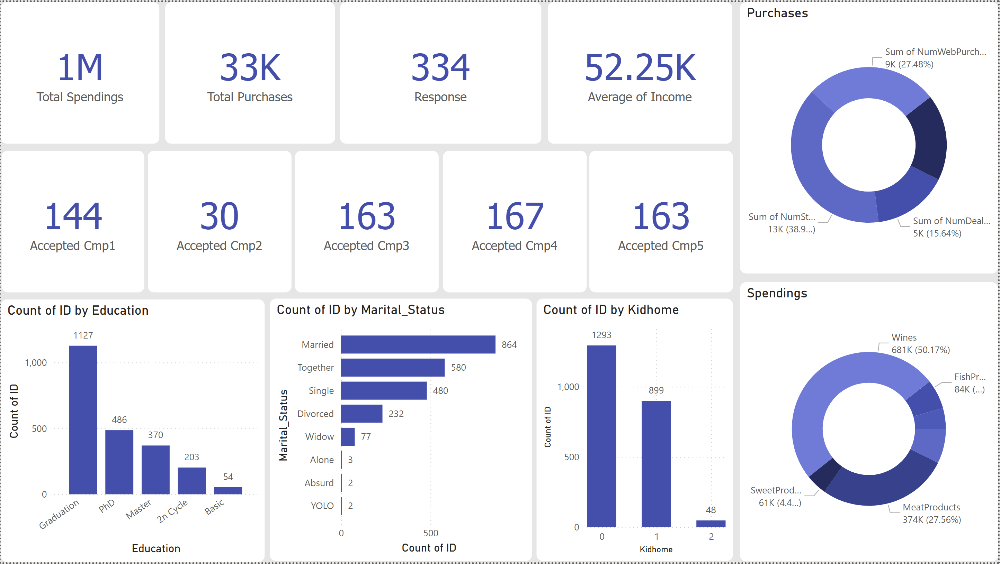

# Marketing-Campaign-Analysis

---
## 📺 Preview

### Dashaboard Preview - Power Bi


---

## 🍵 Features

- 📊 **Comprehensive Data Analysis**: Performed exploratory data analysis (EDA) to uncover insights from marketing campaign data.
- 🤖 **Machine Learning Models**: Built and evaluated predictive models to analyze campaign effectiveness.
- 📈 **Interactive Dashboard**: Visualized key metrics and trends using a Power BI dashboard.
- 🛠️ **Custom Utilities**: Leveraged reusable utility functions for streamlined data processing.
- 🧰 **Error Handling**: Robust exception handling for smoother execution and debugging.
- 📝 **Detailed Logging**: Maintained logs for tracking execution and debugging purposes.
- 📂 **Modular Codebase**: Organized project structure for better maintainability and scalability.

---

## 🗂️ Project Structure
```
Marketing-Campaign-Analysis/
├── 📄 README.md
├── 📄 template.py
├── 📄 app.py
├── 📄 git
├── 📄 requirements.txt
├── 📄 setup.py
├── 📁 src
│   └── 📁 marketing_campaign_analysis
│       ├── 📄 logger.py
│       ├── 📄 utils.py
│       ├── 📄 exception.py
│       ├── 📄 __init__.py
│       ├── 📁 components
│       │   ├── 📄 data_ingestion.py
│       │   ├── 📄 data_transformation.py
│       │   ├── 📄 model_trainer.py
│       │   ├── 📄 model_evaluation.py
│       │   └── 📄 __init__.py
│       └── 📁 piplines
│           ├── 📄 prediction_pipeline.py
│           ├── 📄 training_pipeline.py
│           └── 📄 __init__.py
└── 📁 notebook
    ├── 📄 2 . Machine learning.ipynb
    ├── 📄 1 . EDA.ipynb
    └── 📁 data
        └── 📄 marketing_campaign.csv

```
---

## 🛠️ Technologies Used

           


---

## 📥 Installation

Install dependencies:

```bash
pip install -r requirements.txt
```

Setup :

```bash
python app.py
```

---


---

## 🚧 Project Status

This project is currently under development. If you have any suggestions or would like to contribute, feel free to reach out via email at [aryan.rakholiya@outlook.com](mailto:aryan.rakholiya@outlook.com).

---

## 👋 Greetings

Thank you for visiting this project! Your feedback and contributions are highly appreciated. Stay tuned for updates!

---


